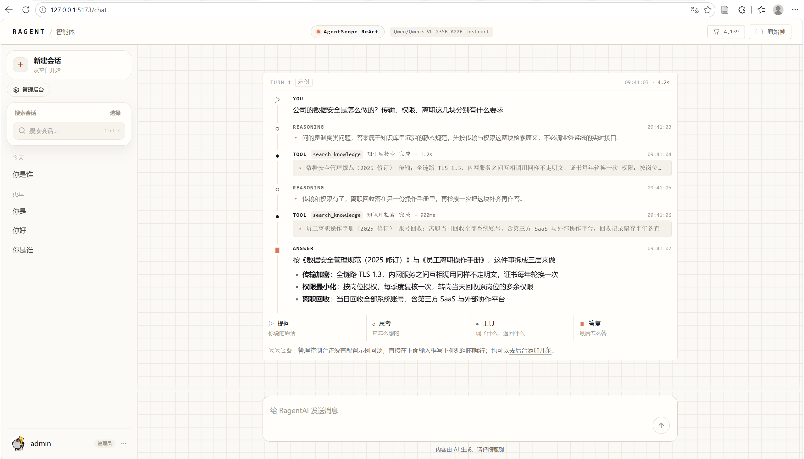

# CS-agent

比特严选智能客服 Agent —— 企业级 Agentic RAG 系统。

## 技术栈

- 后端：Java 21 + Spring Boot 4.1.1 + AgentScope 2.0.2
- 向量库：Milvus 2.6.6
- 工具协议：MCP 1.1.2
- 前端：React 18 + TypeScript + Vite

## 项目结构
CS-agent/
├─ framework/ # 通用框架：响应、异常、Trace、线程池
├─ infra-ai/ # AI 基础设施：模型路由、Embedding、Milvus 适配
├─ system/ # 系统管理：用户、权限、配置
├─ rag/ # RAG 能力：入库 Pipeline、检索、融合、Rerank
├─ agent/ # Agent 引擎：ReAct、工具注册、记忆
├─ mcp-server/ # MCP 服务端：业务工具
├─ bootstrap/ # 启动模块
└─ frontend/ # 前端工程

## 快速开始

### 前置要求

- JDK 21
- Maven 3.9+
- Docker Desktop

### 启动中间件

```bash
cd deploy
docker compose up -d

